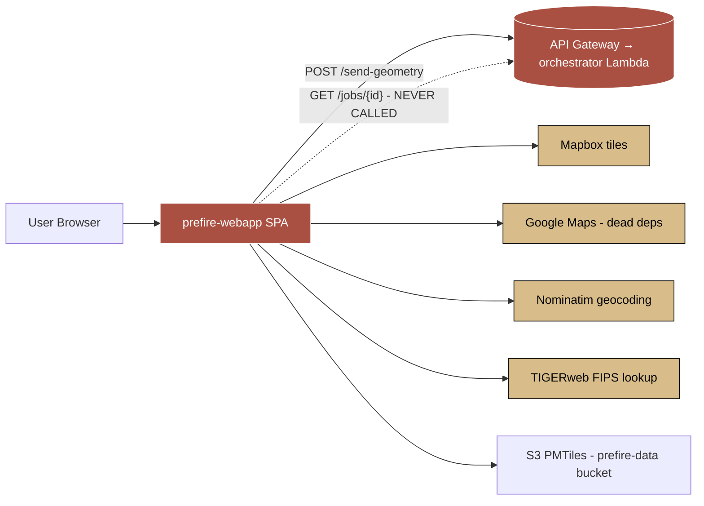

# Frontend Audit — 2026-06-12

Repo: `prefire-webapp` (Vite 7 + React 19 + TypeScript 5.8 strict). 33 TS/TSX source files.
Audit runbook: [.github/prompts/code-audit-fe.prompt.md](../../../../prefire-server/.github/prompts/code-audit-fe.prompt.md) (lives in `prefire-server`).
Cross-stack report: [2026-06-12-fullstack-audit.md](../../../../prefire-server/docs/audits/2026-06-12-fullstack-audit.md).

---

## Status — 2026-06-15 (Post-Remediation)

| id | severity | status | commit / note |
|---|---|---|---|
| `fe-p25-001` | P0 | ✅ Code shipped, ⏳ **deploy pending** | `a4ea2cb` — CloudFront response-headers policy (CSP / HSTS / nosniff / Referrer-Policy / frame-ancestors). Must be applied with `AWS_PROFILE=prefire-root ./infra/apply-cloudfront-headers.sh`. |
| `fe-p25-002` | P0 | ✅ Shipped | `8a17df1` — `react-router-dom` bumped past CVE; `npm audit --audit-level=high` added to CI. |
| `fe-p25-003` | P0 | ✅ Shipped | `3d84e2b` — shared `<Modal>` primitive with focus trap, Escape, focus restore, `role="dialog"` + `aria-modal`; adopted across 3 popups + NavBar. |
| `fe-p25-004` | P2 (was P0) | ✅ Shipped (small fix) | `8a17df1` — error branching on 4xx/5xx/network; retry button. Full report-page work moves to [Deferred Features](#deferred-features). |
| `fe-p25-005` | P1 | ✅ Shipped | `5fa4d75` — uninstalled 5 unused deps, moved `axios` to deps, declared `react-router`. |
| `fe-p25-006` | P1 | ✅ Shipped | `8a17df1` — `import.meta.env.VITE_API_URL` honoured; BE `/health` endpoint added. |
| `fe-p25-007` | P1 | ✅ Shipped | `9a42387` — all `any` removed from MappingTool, `tileerror` banner, leaflet-draw hook-dep fixes, GeoJSON typing via `geojson` types. |
| `fe-p25-008` | P1 | ✅ Shipped | `9cb9aaf` — husky pre-commit running lint + build + test; CI gates on lint/test. |
| `fe-p25-009` | P1 | ✅ Shipped | `9cb9aaf` — `eslint-plugin-jsx-a11y` + `eslint-plugin-security` (recommended rulesets) added. |
| `fe-p25-010` | P1 | ✅ Mitigated by Step 2 | `dangerouslySetInnerHTML` sink is now constrained by CSP `script-src` once `fe-p25-001` deploys. No code change to BlogPost; sanitizer is a future hardening. |
| `fe-p25-011` | P1 | ⚠️ Not addressed | Prerender escaper / `BASE_URL` hardcoding — non-blocking; bundle with next deploy-script touch. |
| `fe-p25-012` | P2 | ⚠️ Not addressed | Chunking-strategy docs / depcheck false-positive cleanup. Cosmetic. |
| `fe-p25-013` | P2 | ✅ Shipped | `9cb9aaf` — Vitest + RTL + jsdom bootstrapped; 11 tests pass (Modal, apiFetch). Test count will grow per-touched-feature. |
| `fe-p25-014` | P2 | ⚠️ Not addressed | `emptyOutDir` flag on rebuild; trivial. |
| `cs-008` (geocode proxy) | P2 | ✅ Shipped | BE `59a94df` (`/geocode` + per-IP token bucket) + FE `bf4f5f2` (`apiFetch` helper, `AddressSearchPopup` migrated). |

### Verification snapshot

- `npm test` → 11 passed (Modal × 5, apiFetch × 6).
- `npm run lint` → 0 errors, 3 warnings (security/detect-object-injection in `blog.ts` — false positive, scoped suppression).
- `npx tsc -b` + `npm run build:client` → clean.
- Husky pre-commit gates lint + build + test on every commit.

### Findings carried forward (not shipped)

`fe-p25-011`, `fe-p25-012`, `fe-p25-014` — all P1–P2 cosmetic / build-hygiene; pick up opportunistically. No security impact.

For the full step-by-step remediation status across both repos, see: [../../../../prefire-server/docs/audits/2026-06-12-fullstack-audit.md#status--2026-06-15-post-remediation](../../../../prefire-server/docs/audits/2026-06-12-fullstack-audit.md).

---

## Executive Summary

| Severity | Count |
|---|---|
| **P0** | 3 |
| **P1** | 7 |
| **P2** | 4 |
| **P3** | ~5 (kept in per-shard YAML, not promoted) |

**Headline**: A public-internet SPA serves user-submitted geometry and rendered markdown with **no security-headers policy, no CSP, three high-severity react-router CVEs, and every modal failing keyboard/SR accessibility**. Plus zero CI, zero tests, and zero a11y/security lint rules. The codebase is small and clean by formatter standards, but the operating envelope is wide open.

**Top three fixes** (single-PR each, retire all three P0s):
1. **Wire a CloudFront response-headers policy** (CSP + HSTS + nosniff + Referrer-Policy + frame-ancestors). Retires fe-p25-001 and provides defence-in-depth for fe-p25-010 (BlogPost XSS).
2. **Bump `react-router-dom` to ≥ 7.14.3** and add `npm audit --audit-level=high` to CI. Retires fe-p25-002 and half of fe-p25-008 in one go.
3. **Build a shared `<Modal>` primitive** (role/dialog + focus trap + Escape) and use it in all three popups + NavBar mobile menu. Retires fe-p25-003 plus 4 P1 a11y findings.

> **Note on the submit pipeline (formerly `fe-p25-004` P0)**: the original audit flagged the fire-and-forget submit flow as P0. On reclassification this is a UX gap, not a security vulnerability — the email-on-completion model is the contract today and there is no exploit. Reclassified to **P2** (`fe-p25-004`); add a small visible-error fix (~10 lines, see step 4 below). The full report-page-with-polling design is captured in [Deferred Features](#deferred-features) for later.

---

## Trust Boundaries



Red nodes lack a validation boundary; the SPA itself has no CSP and renders untrusted (today: in-tree, future: any source) markdown with `dangerouslySetInnerHTML`.

---

## P0 Findings (3)

| id | file | summary |
|---|---|---|
| `fe-p25-001` | deploy.sh / CloudFront | No CSP, HSTS, X-Frame-Options, nosniff, or Referrer-Policy. |
| `fe-p25-002` | package.json | `react-router-dom@^7.8.2` has 3 high-severity CVEs (turbo-stream RCE, open redirect, RSC XSS). |
| `fe-p25-003` | ConfirmSubmitPopup.tsx / QuestionnairePopup.tsx / AddressSearchPopup.tsx | No `role="dialog"`, no focus trap, no Escape, no focus restore. Modals unusable by keyboard / SR. |

Full evidence and remediation: [tmp/audit/phase25-opus.yaml](../../tmp/audit/phase25-opus.yaml).

---

## P1 Findings (7)

| id | file | summary |
|---|---|---|
| `fe-p25-005` | package.json | 5 unused deps (Google Maps + terra-draw + proj4), `axios` in devDeps but imported at runtime, `react-router` undeclared. |
| `fe-p25-006` | src/lib/constants.ts:2 | `import.meta.env.NODE_ENV` never set by Vite — local-dev branch is dead. VITE_API_URL declared but unused. |
| `fe-p25-007` | src/components/MappingTool.tsx (multi) | TIGERweb WHERE-string injection (limited), no AbortController on any fetch, ZoomTracker double-fires, leaflet-draw stale closure, walk() no GeoJSON validation. |
| `fe-p25-008` | .github/workflows (absent) | No CI, no pre-commit, no test suite. |
| `fe-p25-009` | eslint.config.js | No `eslint-plugin-jsx-a11y` or `eslint-plugin-security`. |
| `fe-p25-010` | BlogPost.tsx:24 | `marked()` → `dangerouslySetInnerHTML` with no sanitization. Safe today (in-tree content) but no test guards the invariant. |
| `fe-p25-011` | prerender.mjs:20 / :79 | HTML escaper misses `&` and `'` (double-encode risk); BASE_URL hardcoded to prod. |

---

## P2 Findings (4)

| id | file | summary |
|---|---|---|
| `fe-p25-004` | ConfirmSubmitPopup.tsx:108 | Submit POST error handler only `console.error`s — user sees the spinner stop with no feedback. **Not a security issue; UX only.** Small fix (~10 lines) covers this; the larger report-page-polling work is [deferred](#deferred-features). |
| `fe-p25-012` | vite.config.ts / package.json | Document chunking strategy; clean depcheck false-positive after dep purge. |
| `fe-p25-013` | tests/ (absent) | Zero automated tests. |
| `fe-p25-014` | dist/ | No emptyOutDir on rebuild; stale pre-rendered blog HTML possible (see cfg-016). |

---

## P3 / Nits (~5)

Captured in per-shard YAML, not promoted. Includes: rollback mechanism, CloudFront invalidation cost optimisation, deploy.sh output message correction, `.env.example` documentation, ESLint `globalIgnores` of build scripts.

See: [tmp/audit/shard-mappingtool.yaml](../../tmp/audit/shard-mappingtool.yaml), [tmp/audit/shard-a11y.yaml](../../tmp/audit/shard-a11y.yaml), [tmp/audit/shard-config.yaml](../../tmp/audit/shard-config.yaml).

---

## Cross-Stack Hooks → see fullstack report

| Frontend finding | Backend pairing |
|---|---|
| `fe-p25-001` (no CSP) | BE `p25-001` (no auth) — no defence in depth on the public attack surface. |
| `fe-p25-006` | BE `p25-010` (dual-layer CORS) — env-wiring drift end-to-end. |
| `fe-p25-007` (TIGERweb WHERE) | BE `p25-005` (no input validation) — both ends trust externally-shaped data. |
| `fe-p25-004` (deferred — see below) | BE `p25-002` (no payload cap) — unrelated for the security audit; pair only when building the report page. |

---

## Process Gaps

- No `.github/workflows/` — nothing enforced on PR.
- No pre-commit / husky.
- No test framework or test files.
- ESLint missing jsx-a11y + security plugins.
- TypeScript strict mode IS on (good) but `any` is allowed and used 12× in MappingTool.tsx (ESLint reports as errors but no CI fails).

---

## Deferred Live-Server Checks

- axe-core via Playwright — skipped, no dev server running, no Playwright config in repo.
- Lighthouse / PageSpeed — skipped for same reason.
- Color-contrast measurements (a11y-011) — noted as warnings; need real-render confirmation.

Run with:

    npm run dev   # in one terminal
    npx lighthouse http://localhost:5173 --output=json --output-path=tmp/audit/lighthouse.json --quiet --chrome-flags="--headless"

---

## Tool Output Index

| Tool | Findings | Path |
|---|---|---|
| tsc --noEmit | 0 errors | [tmp/audit/tsc.txt](../../tmp/audit/tsc.txt) |
| ESLint | 14 (12 `any`, 2 hook-deps) | [tmp/audit/eslint.json](../../tmp/audit/eslint.json) |
| Knip | 5 unused deps + 1 unused devDep + 2 unused files (1 false positive: entry-server.tsx) + 4 unused types | [tmp/audit/knip.json](../../tmp/audit/knip.json) |
| Madge | 0 circular deps | [tmp/audit/madge.txt](../../tmp/audit/madge.txt) |
| Depcheck | 6 unused deps (corroborates knip) + 1 missing (`react-router`) | [tmp/audit/depcheck.json](../../tmp/audit/depcheck.json) |
| npm audit | 2 high (`react-router`, `react-router-dom`) | [tmp/audit/npm-audit.json](../../tmp/audit/npm-audit.json) |
| Secretlint | 0 secrets in tree | [tmp/audit/secretlint.json](../../tmp/audit/secretlint.json) |
| osv-scanner | N/A — Go binary, not on npm. Coverage via npm audit. | — |

Sonnet semantic shards:
- [shard-mappingtool.yaml](../../tmp/audit/shard-mappingtool.yaml) — 15 findings (MappingTool deep dive)
- [shard-a11y.yaml](../../tmp/audit/shard-a11y.yaml) — 16 findings (all components)
- [shard-config.yaml](../../tmp/audit/shard-config.yaml) — 21 findings (build/deploy/headers)

Opus consolidation: [phase25-opus.yaml](../../tmp/audit/phase25-opus.yaml).

---

## Suggested Remediation Order

1. **react-router-dom bump** (5 min, retires `fe-p25-002`).
2. **CloudFront response-headers policy** (~half day, retires `fe-p25-001`).
3. **CI workflow + ESLint plugins** (~half day, retires `fe-p25-008` + `fe-p25-009`).
4. **Submit error UX** (~10 lines in `ConfirmSubmitPopup.tsx` — surface 4xx detail from `response.data.detail`, generic message for 5xx/network, retry button. Retires `fe-p25-004` and `cs-005`. Does **not** touch the fire-and-forget shape.)
5. **Shared `<Modal>` primitive** + adopt in 3 popups + NavBar (~1 day, retires `fe-p25-003`).
6. **Dep cleanup** (`npm uninstall` × 5, axios → deps, declare react-router) (~30 min, retires `fe-p25-005`).
7. **constants.ts env wiring** (5 min, retires `fe-p25-006`).
8. **MappingTool refactor** (multi-PR, retires `fe-p25-007`).
9. **Testing bootstrap** (Vitest + RTL scaffold, then per-touched-feature growth — retires `fe-p25-013` over time).

*(Step 4 was originally a full submit-pipeline rewrite with polling — that work is now in [Deferred Features](#deferred-features) and is not part of this audit's security remediation queue.)*

---

## Deferred Features

Two related items move out of the security-remediation queue into the product backlog. The full design (BE + FE) lives in the fullstack audit: [Deferred Features](../../../../prefire-server/docs/audits/2026-06-12-fullstack-audit.md#deferred-features). FE-facing summary:

1. **Submit-endpoint protection — Cloudflare Turnstile widget + AWS WAF** (formerly remediation Step 10).
   - Anonymous product → no JWT/Cognito. Turnstile gives a human-presence signal; WAF handles volumetric abuse at the edge.
   - FE work: render Turnstile in `ConfirmSubmitPopup`, attach `X-Turnstile-Token` header on submit. `apiFetch` already handles the request lifecycle.
2. **Report Page — Capability-URL Polling** (originally deferred from `fe-p25-004`).

The report-page design follows below — it is unchanged from the 2026-06-12 deferral; the Turnstile work should ship in the same product release to keep the submit-flow polish in one PR.

---

### Report Page — Capability-URL Polling (design)

**Why deferred**: this is product/UX work, not security. The current architecture (submit → BE runs pipeline → email-with-report-link delivered on completion) is sound. Bumping it up to P0 in the original audit was over-classification; it does not unlock or block any security finding. Build it when product priorities call for in-app job visibility, not as part of audit remediation.

**Why it's still worth doing eventually**:
- Today, if the pipeline fails partway, the user receives nothing — the submit form's success message is the only signal they get, and it's a lie.
- Email deliverability is imperfect; some users will lose the report link to spam folders with no recourse.
- The `GET /jobs/{job_id}` endpoint already exists on the BE (see `src/api/routers/send_geometry.py:78`), `job_store.set_complete(job_id, result_url)` already records the artifact URL, and `send_report_email(recipient, job_id, report_url)` is already link-based. The plumbing is done; only the FE consumer is missing.
- The job_id is a UUID4 (~122 bits of entropy) → the report URL functions as a capability token (same security model as Google Docs share links), which means **no auth scaffolding is required to make this safe** as long as the URL is not indexed.

**Design**:

BE changes (small):
1. In [src/api/routers/send_geometry.py](../../../../prefire-server/src/api/routers/send_geometry.py) or `_compute.launch`, send the email **immediately after job creation**, not on completion.
   - New subject: "Your wildfire report is being generated"
   - Body: "View it here: https://prefire.online/report/{job_id} — the page will update when the report is ready."
2. Skip the second "ready" email. Users who care will keep the tab open or revisit.
3. Add `X-Robots-Tag: noindex, nofollow` response header on `GET /jobs/{job_id}` (in the FastAPI route, or via API Gateway response-headers policy). The FE report page also sets `<meta name="robots" content="noindex">`.

FE changes (medium):
1. New route `/report/:jobId` in [src/app/App.tsx](../../../src/app/App.tsx) and the router config. Single component, no auth, no header.
2. New file `src/components/ReportPage.tsx`:
   - On mount: `GET ${API_BASE}/jobs/{jobId}` once.
   - Validate response with a Zod schema:
     ```ts
     const JobStatus = z.discriminatedUnion("status", [
       z.object({ status: z.literal("PENDING"), job_id: z.string().uuid() }),
       z.object({ status: z.literal("RUNNING"), job_id: z.string().uuid() }),
       z.object({ status: z.literal("COMPLETE"), job_id: z.string().uuid(), result_url: z.string().url() }),
       z.object({ status: z.literal("FAILED"), job_id: z.string().uuid(), error: z.string() }),
     ]);
     ```
   - PENDING / RUNNING → show a friendly progress card, poll every 5s, double interval each retry, cap at 60s, give up after 30 min with a "contact us" message.
   - COMPLETE → render the report (see option below).
   - FAILED → show error + "report this issue" mailto link.
   - 404 → "This report link is invalid or older than retention." (today: forever; add a DynamoDB TTL when this lands).
3. Add a `useDocumentMeta("noindex")` hook so the page is excluded from search even if accidentally shared.
4. AbortController on the fetch + cleanup on unmount.
5. New file `src/lib/api.ts` (small helper for `apiFetch(url, { signal, timeoutMs })`) — also retires the unrelated MappingTool fetch-hygiene work from `fe-p25-007b`.

**Report rendering option** (architecturally significant — needs its own decision when work starts):
- **(A)** FE re-implements the report layout in React, fetching JSON from a new `GET /jobs/{job_id}/result.json` BE endpoint. Cleanest separation; biggest piece of work. Recommended.
- **(B)** FE iframes the existing `report.html` artifact at `result_url`. Fastest; visually ugly; sandboxing required (`sandbox="allow-same-origin"` or stricter).
- **(C)** FE injects the BE HTML via `dangerouslySetInnerHTML`. **Do not pick this** — it creates the XSS surface we're trying to remove via `fe-p25-010`.

**Findings retired when built**:
- `cs-001` (FE discards response) — replaced by a defined contract: submit acks via 200 → email-as-receipt → report page is the canonical viewer.
- `cs-004` (no response validation) — Zod schema added on the consumer side that actually uses the data.
- `cs-007` (dead GET endpoint) — endpoint now has an active consumer.
- `fe-p25-004` (currently P2) — closed when the page exists.

**Findings NOT retired** (still need separate work):
- BE `p25-001` (no auth on submit) — capability URLs only protect the read side.
- BE `p25-002`/`p25-005` (no payload caps) — fix independently in remediation step 5.

**Effort**: ~2 days end-to-end if option (A). 1 day if (B). Includes Zod schema, ReportPage component, BE email-send relocation, BE result-JSON endpoint (option A only), tests, manual QA.

**Open questions to resolve before starting**:
- Should the BE add a DynamoDB TTL on job records (e.g. 30 days)? Without one, report links live forever and the table grows unbounded.
- One email or two (submit ack + completion notice)? Default: one.
- Option A / B / C for rendering?
- Should the report page render shareable / printable views?
